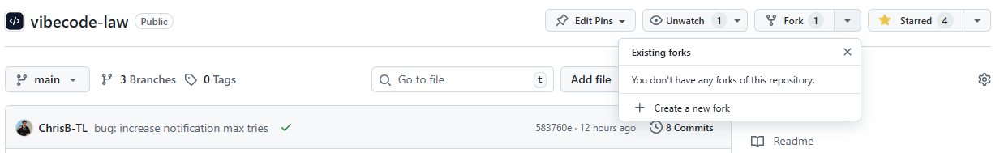
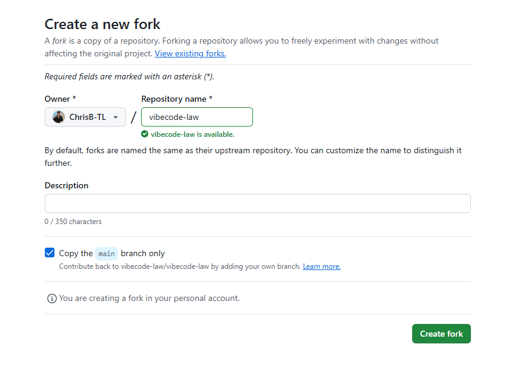
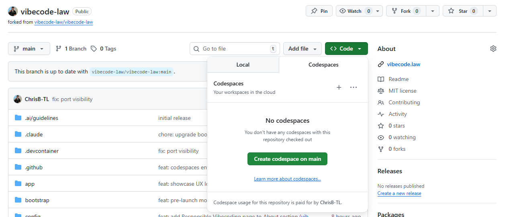
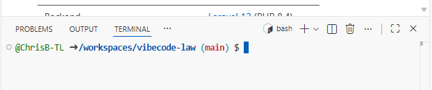
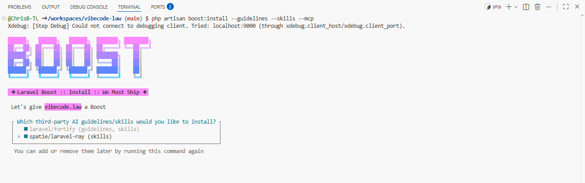
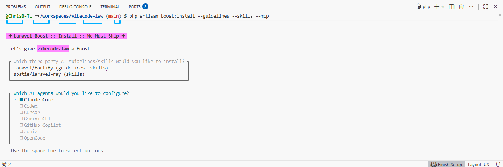
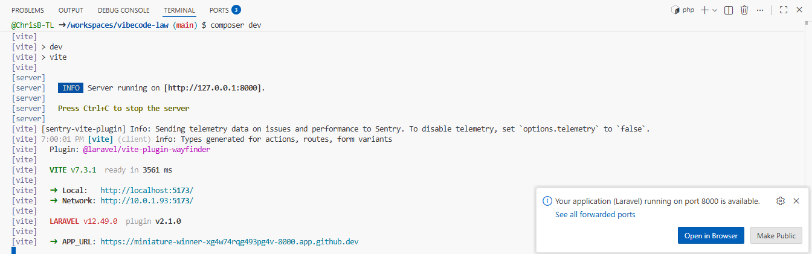
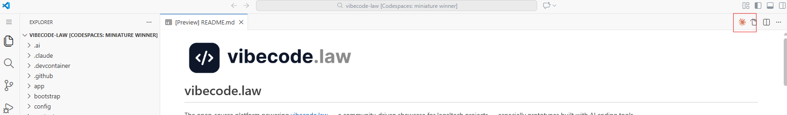

# Getting Started using Github Codespaces Guide

This guide covers the easiest way to get started. It assumes you don't want to install anything locally, and wish to run and develop fully remotely.

It relies on Github Codespaces, which provides you with ~120 hours of remote development per month for free (plus the cost of your AI coding of choice!). 

For simplicity, for AI coding we assume you use Claude Code. However, you could equally use Cursor or Copilot.  We'll add guides for using those in conjunction with Github Codespaces later.

## Step 1: Fork the repository

_If you are just playing around, and don't intend to contribute a PR later, you can skip this step and just use the vibecode-law/vibecode-law URL in Step 2 instead of your fork._

In the Github web UI, create a fork from the top right context menu:



On the page that opens, you don't need to fill anything out - just hit "Create fork" in the bottom right:



After creating, you'll be redirected to your new fork.

## Step 2: Access Codespaces

Make sure you are in your fork in the Github UI. 

The tell take signs will be (a) "forked from vibecode-law/vibecode-law" under the name; and (b) a box saying "This branch is up to date with vibecode-law/vibecode-law":


Now click the green "Code" button, and go to the "Codespaces" tab and click the "Create codespace on main":



This will open the repository in a web version of VSCode. 

It'll take ~5 minutes to setup. You'll know once its done, as the terminal at the bottom will clear itself to an empty state - like so:



# Step 3 (optional): Install Laravel Boost

If you plan to use Claude Code or another AI coding tool, it's worth installing Laravel Boost by pasting the following command into the terminal and pressing enter:

```bash
php artisan boost:install --guidelines --skills --mcp
```

In the UI that appears, use the arrows and space bar to select all guidelines/skills offered then press enter:



In the next menu, use the arrows and space bar to select the AI tools you will use (in this picture, just Claude Code) and press enter once ready:



Boost is now installed.

# Step 4: Boot up the application

In the terminal, enter the following command

```bash
composer dev
```

After a few seconds, your terminal should look something like this:



Hold Control / Command and click on the APP_URL at the bottom. This will open the app in your browser.

# Step 5: Vibe!

The browser window will automatically reload as you make changes, though it may need a manual refresh if you hit an error.

You can open up the Claude Code UI in the editor by clicking on the orange Claude logo in the top right:



You'll need to authenticate by following the onscreen instructions.

When asked if you want to open an external website click Cancel, and manually copy the link it offers you instead and paste it into your browser - as the link it opens automatically will not redirect correctly in this environment. 

Follow the instructions in your browser, and then paste the code Anthropic gives you back into the Claude menu within the editor.

Sometimes you'll get a blank Claude screen after authenticating. If so close the Claude tab and re-open it.

Prompt away!

# Step 6 (optional): Submit your first PR

If you want to contribute back to the vibecode-law codebase, check out the [Contribution Guidelines](../.github/CONTRIBUTING.md) or the more detailed [Pull Requests for Beginners Guide](./PULL_REQUEST_GUIDE.md).